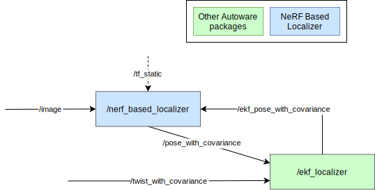

# NeRF Based Localizer

NeRFBasedLocalizer is a vision-based localization package.

## Node diagram



## Inputs / Outputs

### Input

| Name            | Type                                            | Description                      |
| :---------------| :---------------------------------------------- | :------------------------------- |
| `~/input/pose`  | `geometry_msgs::msg::PoseWithCovarianceStamped` | EKF Pose without IMU correction. |
| `~/input/image` | `sensor_msgs::msg::Image`                       | Camera Image                     |

### Output

| Name                            | Type                                            | Description                    |
| :------------------------------ | :---------------------------------------------- | :----------------------------- |
| `~/output/pose`                 | `geometry_msgs::msg::PoseStamped`               | estimated pose                 |
| `~/output/pose_with_covariance` | `geometry_msgs::msg::PoseWithCovarianceStamped` | estimated pose with covariance |
| `~/output/score`                | `std_msgs::msg::Float32`                        | estimated score of nerf        |
| `~/output/image`                | `sensor_msgs::msg::Image`                       | estimated image of nerf        |

## How to build

Download libtorch and extract it to the `nerf_based_localizer/external` directory.

If libtorch is prepared, it can be built as a normal package.

## How to launch

Set the train result directory to the parameter `train_result_dir` in the `nerf_based_localizer/config` file.

When launching Autoware, set `nerf` for `pose_source`.

```bash
ros2 launch autoware_launch ... \
    pose_source:=nerf \
    ...
```

For example, to run `logging_simulator`, the command is as follows.

```bash
ros2 launch autoware_launch logging_simulator.launch.xml \
    map_path:=/path/to/map \
    pose_source:=nerf \
    vehicle_model:=sample_vehicle \
    sensor_model:=awsim_sensor_kit \
    perception:=false \
    planning:=false \
    control:=false
```

[The rosbag for AR tag-based localizer](https://drive.google.com/file/d/1uMVwQQFcfs8JOqfoA1FqfH_fLPwQ71jK/view) can be used.

## How to train

### Prepare training data

TODO

### Execute training

Use training_tool.

```bash
cd nerf_based_localizer/training_tool/script
./build_and_exec_training.sh /path/to/result_dir/ /path/to/prepared_data/
```
